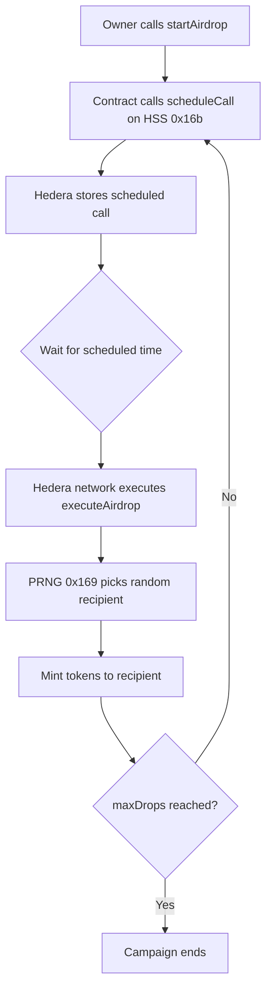

# Architecture: Self-Scheduling Loop

```mermaid
graph TD
    A[Owner calls startAirdrop] --> B[Contract calls scheduleCall on HSS 0x16b]
    B --> C[Hedera stores scheduled call]
    C --> D{Wait for scheduled time}
    D --> E[Hedera network executes executeAirdrop]
    E --> F[PRNG 0x169 picks random recipient]
    F --> G[Mint tokens to recipient]
    G --> H{maxDrops reached?}
    H -->|No| B
    H -->|Yes| I[Campaign ends]
```
